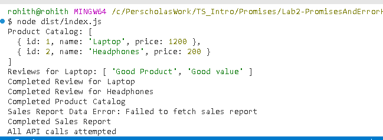

Project Overview

This project is a simulated API workflow built using Promises in TypeScript/JavaScript. It mimics real-world asynchronous API calls, including product catalog fetching, product reviews, and sales reports. The key idea is to handle each API call independently with proper error handling while demonstrating sequential execution and custom error management.

Key Points of the Overview

Purpose: Simulate API calls with delays, random failures, and realistic data.
Components:
fetchProductCatalog() → fetches list of products
fetchProductReviews(productId) → fetches reviews for each product
fetchSalesReport() → fetches sales data
Error Simulation:
Random failures to mimic network issues (NetworkError)
Random invalid data to mimic API errors (DataError)
Execution Flow:
Fetch product catalog → fetch reviews (parallel per product) → fetch sales report

Each step uses .then(), .catch(), .finally()

Features

Simulated API calls
fetchProductCatalog() → fetches product list
fetchProductReviews(productId) → fetches reviews for a product
fetchSalesReport() → fetches sales data

Asynchronous handling with Promises
Uses .then(), .catch(), and .finally()

Sequential execution: Product Catalog → Reviews → Sales Report

Custom error handling
NetworkError → simulates network failures
DataError → simulates invalid or missing data
Each API call handles its own errors individually

Challenges

Sequential execution of dependent calls
Reviews should only be fetched after catalog is available
Sales report should wait for reviews to complete
Error handling per API call
Errors in one call should not stop the rest of the workflow
Simulating realistic failures
Randomized rejection of Promises mimics network unreliability

Logging and debugging

Tracking which product/review caused an error can be tricky without structured errors

1. Why is it important to handle errors for each individual API call rather than just at the end of the promise chain?

Granular feedback: We know exactly which API failed (catalog, a specific product’s reviews, or sales report).
Workflow continuity: One failure (e.g., one product review) does not stop other API calls from completing.
Better logging: Each error can be logged with the relevant context (product ID, API name), making debugging faster.

If you only catch errors at the end of the chain:
You get a generic error with no context.
You can’t differentiate whether it was catalog failure, a specific review, or sales report.

2. How custom error classes improve debugging

Clarity: NetworkError vs DataError tells you immediately whether the failure is network-related or data-related.
Structured handling: You can handle different errors differently 
Better logging: Error name and message can be logged systematically, which is helpful for debugging complex workflows.

3.When a retry mechanism is more effective

Network issues or temporary API failures: Sometimes a request fails due to a momentary issue. Retrying after a short delay can succeed.
Intermittent server problems: Instead of failing immediately, retries increase resilience.
Important for high-reliability apps: E-commerce, financial apps, or dashboards where temporary failures should not block the whole workflow.

Thanks for all the clssmates and the teachers

Result screen shot 
